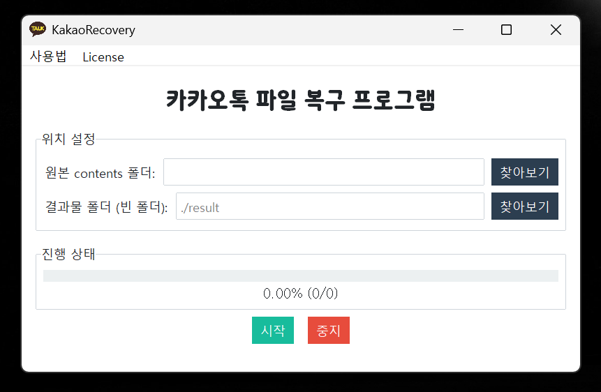

# KakaoRecovery 🔍

카카오톡에서 만료되어 사라진 파일들을 되찾아드립니다! 🚀

<div align="center">
    
</div>

## 소개 📝

KakaoRecovery는 카카오톡의 만료된 파일을 `Android\data\com.kakao.talk\contents` 폴더에서 복구해주는 무료 오픈소스 도구입니다.

> 유튜브 가이드 -> https://www.youtube.com/watch?v=m23KHWat6u8

## 사용 방법 🎯

1. [GitHub 릴리즈 페이지](https://github.com/tionlab/KakaoRecovery/releases/latest)에서 KakaoRecovery.zip 최신버전(v0.2.0) 다운로드 및 압축해제
2. KakaoRecovery 실행
3. '원본 contents 폴더' 경로 지정
4. '시작' 버튼 클릭

> result 폴더가 자동으로 생성되고 그 안에 파일들이 복구됩니다.

## 주요 특징 ✨

-   🎯 간단한 GUI 인터페이스
-   📅 날짜별 자동 정렬
-   🗂️ 파일 형식 자동 감지
-   ⏸️ 진행 중 중지 가능
-   📊 실시간 진행률 표시
-   🔔 작업 완료 알림

## 실행 방법 💿

```bash
# 실행 파일 다운로드 (GUI)
최신 릴리즈에서 KakaoRecovery.zip 다운로드 및 압축해제 후 KakaoRecovery 실행

# 또는 소스코드 실행 (No GUI)
pip install tqdm filetype
python main.py

# (GUI)
cd gui
pip install ttkbootstrap filetype playsound
python gui.py
```

## FAQ

### **Q 1. Android/data 폴더 내부로 접근이 안돼요...**

A. [Android 정책](https://developer.android.com/about/versions/11/privacy/storage?hl=ko#file-access)상 핸드폰 내부에서 더이상 Android/data 폴더의 접근이 어렵습니다.
[DocumentUI를 직접 접근](https://play.google.com/store/apps/details?id=com.marc.files)하여 우회하는 방법은 있으나, PC와 직접 케이블로 연결하셔서 꺼내시는편이 수월합니다.

### **Q 2. 파이썬이나 pip 추가로 설치가 필요한가요?**

A. [GitHub 릴리즈 페이지](https://github.com/tionlab/KakaoRecovery/releases/latest)에 올라간 zip의 exe을 실행시키는 경우 추가 설치가 필요하지 않습니다. 하지만, 소스코드로 실행하시는 경우 파이썬 3.12와 requirements.txt에 적혀있는 모듈을 추가로 설치해주셔야 합니다.

### **Q 3. 사진 동영상과 같은 미디어 파일만 복구되는건가요? 문서 파일은 복구가 안되나요?**

A. 확인해본 결과 문서도 복구가 가능합니다. 단, 몇몇 문서 파일(.hwp)는
확장자가 인식이 되지 않아 파일명이 `문서명.hwp.unknown`으로 복구되었을 수
있습니다. 해당 파일명에서 `.unknown`을 지워주시고 원래 문서 확장자로 바꿔주시면
정상적으로 복구 됩니다.

### **Q 4. 복구가 완료되었는데도 결과물 폴더에 복구된 데이터가 없어요/적어요.**

A. 사용하시는 모바일 기기에서 카카오톡의 데이터/캐시를 삭제하신 경우 contents 폴더에
파일이 남아있지 않습니다. 이 경우 KakaoRecovery 프로그램으로 복구가 어렵습니다.

> 추가 질문사항은 [이곳](https://discord.com/invite/k3qm6RbpHc)을 통해 질문해주세요.

## 주의사항 ⚠️

-   원본 contents 폴더 내 파일을 수정하지 마세요.
-   충분한 디스크 공간을 확보하세요.
-   이 프로젝트는 (주)카카오의 게시 중단 요청 또는 삭제 요청이 있을 시 즉시 레포지토리가 삭제됩니다.

## 라이선스 ⚖️

본 소프트웨어는 비상업적 용도로만 사용할 수 있으며, 저작권자의 명시적 동의 없이 상업적 이용은 금지됩니다.  
저작권 정보 및 저작자 이름은 수정 없이 유지되어야 하며, 이와 같은 조건 하에서만 수정 및 배포가 허용됩니다.

이 프로젝트는 GNU Affero General Public License v3.0 with Non-Commercial Clause 라이선스 하에 배포됩니다. 자세한 내용은 [LICENSE](LICENSE) 파일을 참조하세요.

---
